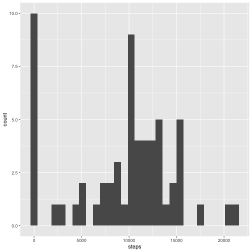
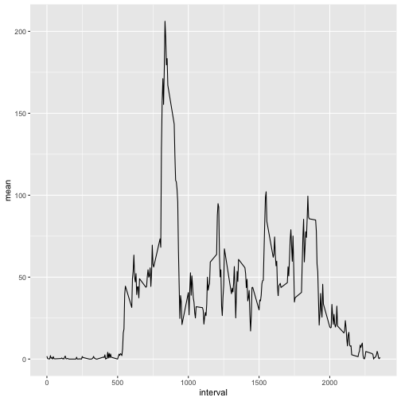
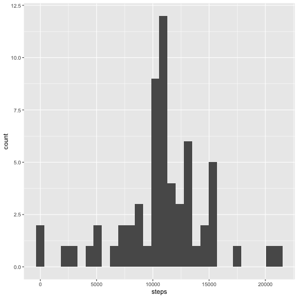
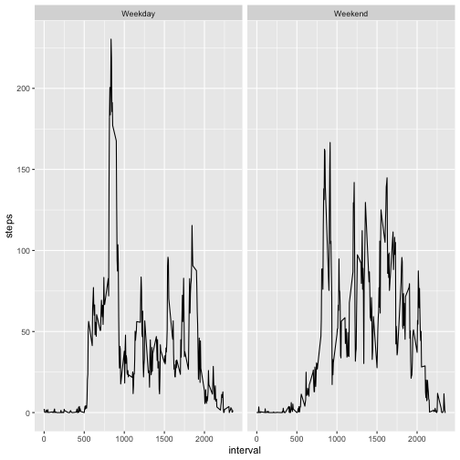

### Load libraries

```r
library(ggplot2)
library(dplyr)
library(knitr)
```

### Load and process/transform the data

```r
unzip("repdata_data_activity.zip")
df <- read.csv("activity.csv")
```

### What is mean total number of steps taken per day?

```r
q1 <- df %>% group_by(date) %>% summarize(steps=sum(steps, na.rm=TRUE))
ggplot(q1, aes(x = steps)) + 
        geom_histogram()
```



```r
mean(q1$steps)
```

```
## [1] 9354.23
```

```r
median(q1$steps)
```

```
## [1] 10395
```

The total number of steps taken per day is shown in the histogram plot. The mean is 9354.23 steps and the median is 10395 steps. 

### What is the average daily activity pattern?

```r
q2 <- df %>% group_by(interval) %>% summarize(mean=mean(steps, na.rm=TRUE))
ggplot(q2, aes(x=interval, y = mean)) +
        geom_line()
```



```r
print(q2[which.max(q2$mean),]$interval)
```

```
## [1] 835
```

Please see the time series plot to view the average numbers of steps taken, averaged across all days. 

The 5-minute interval that contains the maximum number of steps across all the days in the dataset is 835.

### Imputing missing values

```r
a <- nrow(df)
b <- nrow(na.omit(df))
print(a-b)
```

```
## [1] 2304
```

The number of missing values in the dataset is 2304.


```r
filled_df <- df
for (j in 1:nrow(filled_df)){
        if (is.na(df$steps[j])) {
                filled_df$steps[j] <- q2$mean[filled_df$interval[j] == q2$interval]
        }
}
```

The strategy used is to fill with the mean step value for the corresponding 5 minute interval.


```r
q_1 <- filled_df %>% group_by(date) %>% summarize(steps=sum(steps, na.rm=TRUE))
ggplot(q_1, aes(x = steps)) + 
        geom_histogram()
```



```r
mean(q_1$steps)
```

```
## [1] 10766.19
```

```r
median(q_1$steps)
```

```
## [1] 10766.19
```

Above code creates a new dataset with the missing data filled in. A histogram of the total number of steps taken each day is plotted. The mean and median total number of steps taken per day are 10766.19 and 10766.19, respectively. Therefore, the impact of imputing the missing data on the estimates of the total daily number of steps results in an increase in the mean number of steps, and an increase in the median number of steps. 

### Are there differences in activity patterns between weekdays and weekends?

```r
day_df <- filled_df
day_df$date <- as.Date(day_df$date)
for (j in 1:nrow(day_df)){
        if (weekdays(day_df$date[j]) == "Saturday" |
            weekdays(day_df$date[j]) == "Sunday") {
                day_df$day[j] <- "Weekend" 
            } else {day_df$day[j] <- "Weekday" }
}

df_plot <- aggregate(steps ~ day + interval, day_df, mean)
ggplot(df_plot, aes(x = interval, y = steps)) +
        geom_line() + facet_wrap(~ day)
```


